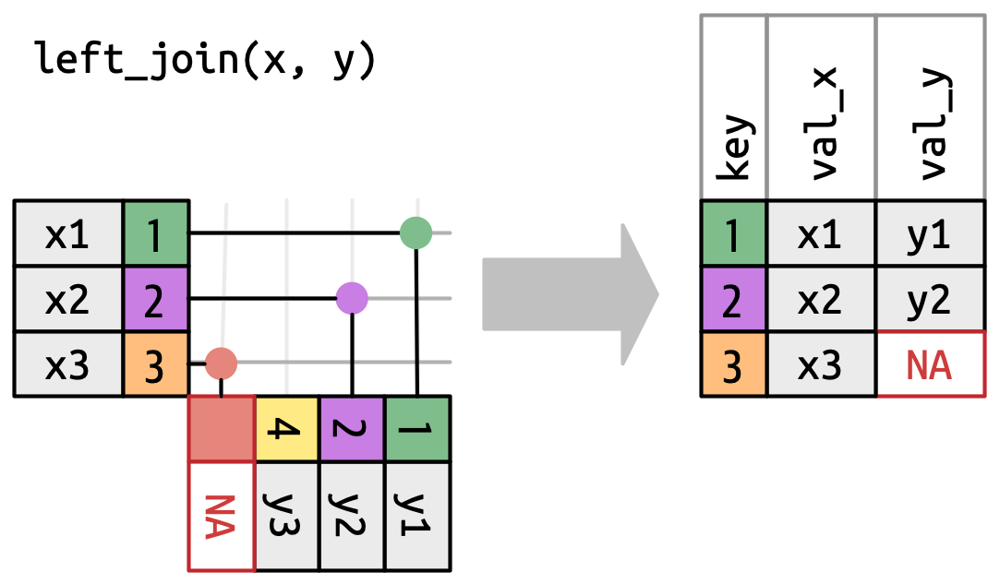
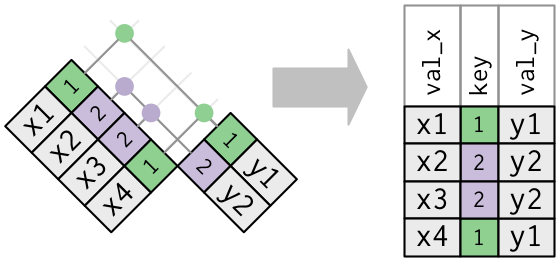

```{r setup, include=FALSE}
library(learnr)
library(tidyverse)
set.seed(2939394)

table1 <- bind_cols(tidyr::table1, continent = c("Asia", "Asia", "South America", "South America", "Asia", "Asia"))

table2 <- pivot_longer(table1, c("cases", "population"))

table4ab <- pivot_wider(table1, id_cols = c("country", "continent"), names_from = "year", values_from = c("cases", "population"))

if (!require(nycflights13)) install.packages("nyclfights13", repos = "http://cran.us.r-project.org")

```

## Review

* Tidy/wide data: rows are observations, columns are measurements
* Tall formats: one column holds more than one type of measurement
* `pivot_longer`: wide to tall
* `pivot_wider`: tall to wide
* naming columns, setting types, splitting into multiple columns


## Example: Tidy/Wide

```{r, echo = FALSE}

```
```{r}
table1
```


What are the units? What are the measurments?

## Example: Tall table
```{r echo = FALSE}
```
```{r}
table2
```

## Relational data

Sometimes we have multiple levels of data. For example,

>* Students with Courses
>* Customers with Orders
>* Players with Games

It may be inefficient to duplicate related information

Solution: **relate** in two tidy tables.


## Example: Relational

```{r, echo= FALSE}
table3_countries <- group_by(table1, country) |> summarize(continent = first(continent))
table3_years <- tidyr::table1
```

```{r}
table3_countries 
table3_years
```

## `nycflights13` library

```{r}
library(nycflights13)
```

Tables:

>* `airlines`: information on the carriers
>* `airports`: information on airports
>* `planes`: the planes flying between airports
>* `weather`: weather conditions
>* `flights`: flight information and connects the other tables

## `airlines`

```{r}
airlines
```

## `airports`

```{r}
airports
```

## `planes`

```{r}
planes
```

## `weather`

```{r}
weather
```

## `flights`

```{r}
flights
```

## Diagram


## Primary Key

The "key" to understanding relational databases is... keys.

A primary key is

>* a variable or

>* set of variables that uniquely identify each observation (compound key).

Single columns: `airports/faa`, `planes/tailnum`,  `airlines/carrier`

Multiple columns:

>* `weather`: `year`, `month`, `day`, `hour` (could be a single date-time column), `origin` (location)
>* `flights`: `year`, `month`, `day`, `hour`, `minute`, `flight`, `origin`, `dest`

## Foreign keys

A **foreign key** is a variable (or set of variables) that corresponds to a **primary key** in another table. For example:

>* `flights$tailnum` is a foreign key that corresponds to the primary key `planes$tailnum`.
>* `flights$carrier` is a foreign key that corresponds to the primary key `airlines$carrier`.
>* `flights$origin` is a foreign key that corresponds to the primary key `airports$faa`.
>* `flights$dest` is a foreign key that corresponds to the primary key `airports$faa`.


## Finding primary keys

Without a diagram, how can you figure out a primary key?

```{r}
count(airports, faa) |> filter(n > 1)
```

Also, double checking in a different way:

```{r}
airports |> nrow()
count(airports, faa) |> nrow()
airports$faa |> unique() |> length()
```


Could the `flight` column uniquely identify the flights?
```{r}
count(flights, flight) |> filter(n > 1)
```

Smallest set of columns I could find:
```{r}
count(flights, flight, year, origin, dest, 
      month, day, hour, minute) |> filter(n > 1)
```

## Exercise

Find a minimal set of columns that create a primary key for the `mpg` table:

```{r}
colnames(mpg)
```


```{r mpgkey, exercise = TRUE}
count(mpg, manufacturer) |> filter(n > 1)
```


## Creating relations: joins

A **primary key** and the corresponding **foreign key** in another table form a _relation_. Relations come in several forms:

>* **One-to-many**. (Most common). For example, each flight has one plane, but each plane has many flights.
>* **Many-to-many**: For example, each airline flies to many airports; each airport hosts many airlines.
>* **One-to-one**: Each row in one table corresponds uniquely to a row in a second table. This is relatively uncommon because you could just as easily combine the two tables into one.


## Joins

Joins are the way we combine or "merge" two data tables based on keys. To understand how joins work we'll study these two simple tables:

```{r}
x = tribble(
  ~key, ~val_x,
     1, "x1",
     2, "x2",
     3, "x3"
)
x
y = tribble(
  ~key, ~val_y,
     1, "y1",
     2, "y2",
     4, "y3"
)
y
```
     

{#id .class width=50%}

## Inner join

Inner joins match a pair of observations whenever their keys are equal:

{#id .class width=50%}

```{r}
# older way of joining
x %>% inner_join(y, by = "key")


# using join_by is preferred
x %>% inner_join(y, join_by('key'))

# below notation useful when the key names are different
x %>% inner_join(y, join_by('key' == 'key'))
```

Where are the rows corresponding to the `key = 3` and `key = 4` values gone?

Answer: With an inner join, unmatched rows are not included in the result.


**Differences between by and join_by**

>* by = "x" corresponds to join_by(x).
>* by = c("a" = "x") corresponds to join_by(a == x).## Venn Diagram of joins


## Outer Join

An outer join keeps observations that appear in at least one of the tables. There are three types of outer joins:

>* A left join keeps all observations in x.
>* A right join keeps all observations in y.
>* A full join keeps all observations in both x and y.


{#id .class width=50%}
{#id .class width=50%}

{#id .class width=50%}

```{r}
x |> full_join(y, join_by(key == key))
```

## Foreign keys are generally duplicate
A primary key is unique but not a foreign key.

{#id .class width=50%}

What is the most common model of the airplane used by each carrier?

```{r}
# most common model

flights |>
  inner_join(planes, join_by(tailnum)) |>
  group_by(carrier, model) |>
    summarise(n = n())|> slice_max(n = 1, n)
```


## More examples

```{r}
left <- head(flights, 10)
right <- filter(airports, faa %in% c("DTW", "BOS", "ORD", "LAX", "ATL"))
left_join(left, right, join_by(dest == faa)) |> select(flight, dest, name)
right_join(left, right, by = c("dest" = "faa")) |> select(flight, dest, name)
full_join(left, right, by = c("dest" = "faa")) |> select(flight, dest, name)
inner_join(left, right, by = c("dest" = "faa")) |> select(flight, dest, name)
```

## Venn Diagram

{#id .class width=50%}

## One-to-one join: carrier names

```{r}
fiveam <- filter(flights, year == 2013, month == 1, day == 1, hour == 5)
select(fiveam, flight, carrier)
```

```{r}
fiveam |> left_join(airlines,
          join_by(carrier)) |> 
  select(flight, carrier, name) 
```

## Multiple one-to-one

If we need to link more than two tables (or two tables more than one time), we build up several joins

```{r}
select(fiveam, flight, origin, dest)
```

```{r}
tmp <- left_join(fiveam, airports, join_by(origin == faa))
select(tmp, flight, origin, name)
```

```{r}
# using the old style of 'by' for a change
left_join(tmp, airports, by = c("dest" = "faa")) |>
  select(flight, origin, dest, name.x, name.y)
```

>* When the same column appears in both tables, it gets the `.x` (left) and `.y` (right) suffix
>* Notice that this is a **left** join because BQN doesn't have a `name.y` entry.

## Slightly cleaner example

```{r}
# using both join_by and by
left_join(fiveam, airports, join_by(origin == faa)) |>
  left_join(airports, by = c("dest" = "faa"), suffix = c("_origin", "_dest")) |>
  select(flight, name_origin, name_dest)
```

## Keys with multiple columns

Examples thus far have used keys in single columns, but keys can be spread across columns (**compound**). 

```{r}
left_join(fiveam, weather, by = c("year", "month", "day", "hour", "origin")) |>
  select(flight, temp, wind_dir, wind_speed)
```

## Natural joins

To avoid lost of redundant typing, if two tables have a set of columns in common, those will automatically be used to join (**natural join**)

```{r}
left_join(fiveam, weather) |>
  select(flight, temp, wind_dir, wind_speed)
```

## Exercise

Join the `flights` and `plains` tables using a `left_join` on `tailnum`. Plot the distribution of flight speed `distance / air_time` against `type`.

```{r speed, exercise = TRUE}

```

## Exercise

The California has an Eastern-most longitude (approx.) of -115. Using the `flights` and the `airports` table, use a join to plot the distribution of scheduled departure time (`sched_dep_time`) from NYC broken out by West coast flights (destination `lon < -115`) and otherwise.

```{r rockyflights, exercise = TRUE}

```


## Filtering using Semi Join

Semi join can be used to filter rows on one table based on their presence or absence in another table. 

{#id .class width=50%}

We've already seen some examples of this on the problem sets:

```{r}
dest_top6 <- count(flights, dest) |> top_n(6)
filter(flights, dest %in% dest_top6$dest) |> nrow()
```

Using Semi-join to achieve the same


```{r}
flights |> semi_join(dest_top6, join_by(dest == dest)) |> nrow()
```


## Anti-join

`anti_join(x, y)` does the opposite of semi_join: it drops all the observations in x that are also in y.

{#id .class width=50%}

Anti-joins are useful for finding mismatches in joins. There are many flights for which there is no tailnum in 'planes' table. To find out more about these flights we could use an anti-join to select only those rows:

```{r}
anti_join(
    flights,
    planes,
    join_by("tailnum")
) |> filter(!is.na(tailnum)) |>
    distinct(tailnum) |>
    print()
```
What could be the reason for missing tailnums in the planes dataframe?

```{r}
flights |> filter(tailnum == "N539AA") |> print(width = Inf)
```

The one plane that is represented is N539AA. You can look it up in an [online database](https://www.flightaware.com/resources/registration/N539AA) and find out it's a private jet. My guess is the others are private jets too.

Picture: https://s3.eu-west-2.amazonaws.com/abpic-media-eu-production/pictures/full_size_0415/1625779-large.jpg

## Other set operations functions

Base R has a series of **set operation** functions that operate on collects as mathematical sets (collections where items can appear at most once): `intersect`, `union`, `setdiff`, `setequal`, `is.element`, `%in%`

I frequently use these for doing comparisons of vectors:
```{r}
"DTW" %in% top_dest$dest # same as is.element
intersect(c("BOS", "LAX", "DTW"), top_dest$dest)
union(c("A", "B", "C"), c("Q", "A", "R"))
setdiff(c("A", "B", "C"), c("Q", "A", "R"))
setequal(c("A", "B", "C"), c("B", "C", "A"))
```

## Set operations with tables

With filtering joins, we can choose which columns link the tables. With the set operations, we must use all columns.

Flights to top destinations that are also delayed:
```{r}
flights_to_top <- semi_join(flights, top_dest) 
flights_delayed <- filter(flights, dep_delay > 0)
intersect(flights_to_top, flights_delayed)
```
