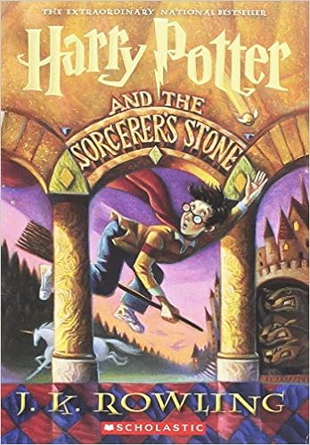

```{r setup, include=FALSE}
library(learnr)
library(tidyverse)
set.seed(2939394)
```

## Review: Regexes

* Any character `.`
* Classes of characters with `[]`
* Start of line `^`, end of line `$`
* White space `\\s`, digits `\\d` 
* Repetition: zero or one `?`, zero or more `*`, `+` one or more
* Alternates `(abc|def)`
* Backreferences `(pattern)` puts the matched string into `\\NUM` (starting with `\\1`)
* Use in column selection (`select`, `pivot_longer`) with `matches`

## Using regular expressions

* Apply regexes to column names or levels
* Finding matches in columns
* Extract information from strings
* Break up strings (tokenize) on more complicated patterns

## Art and Emotion data set

```{r}
wikiart <- read_tsv("./data/WikiArt-Emotions-All.tsv.gz")
wikiart$Year |> unique()
wikiart <- mutate(wikiart, Year = as.numeric(str_sub(Year, 1, 4)))
colnames(wikiart)
```

```{r}
wikiart |> head()
```

## Columns

With lots of columns, we could write things out direct, but better to use regex to find columns matching a pattern:

```{r}
select(wikiart, matches("anger"))
select(wikiart, matches("[tT]itle"))
select(wikiart, matches("[tT]itle."))
```

## Making more tidy

This has lots of **ratings**, let's put them into better columns.

```{r}
pivot_longer(wikiart, 
             matches(":"), 
             names_to = c("rating_type", "emotion"),
             names_sep = ":",
             values_to = "mean_annotation") -> wa_long

select(wa_long, Title, rating_type, emotion, mean_annotation)

wa_long$rating_type |> unique()
```

## Find and replace

Hard to see in previous but there are spaces in the emotions:

```{r}
wa_long$emotion[1:5]
```

Let's remove all white space
```{r}
wa_long <- mutate(wa_long,
                  emotion = str_replace(emotion, "\\s", ""))
wa_long$emotion[1:5]
```

## Using tidy data

```{r}
ggplot(wa_long, aes(x = rating_type, y = mean_annotation)) + geom_boxplot()
```


```{r}
group_by(wa_long, rating_type) |> summarize(mean(mean_annotation > 0))
```

```{r}
filter(wa_long, mean_annotation > 0) |>
  ggplot(aes(x = rating_type, y = mean_annotation)) +
    geom_boxplot()
```

## Grouping by work of art

With the tidy data, we have art-rating type-emotion measurements. Let's aggregate up to the piece level after restricting to the `Art (image+title)` rating group.

```{r}
filter(wa_long, str_detect(rating_type, "Art")) -> filt_df
filt_df |> select(ID, rating_type, mean_annotation, emotion) |> head()

filt_df |>
  group_by(ID) |>
  arrange(desc(mean_annotation)) |>
  summarize(strongest_emotion = first(emotion),
            strongest_emotion_value = first(mean_annotation)) ->
  wa_art_strongest

wa_art_strongest

```

```{r}
ggplot(wa_art_strongest, aes(y = strongest_emotion)) + geom_bar()
```


## Merging original data back in

The original wiki art data was arranged by work of art. Let's merge that back in to get year information.

```{r}
wa_art_strong_year <- left_join(wikiart, wa_art_strongest, by = "ID")
```

Now let's get a break down by year of the percentages of the different categories.

```{r}

wa_art_strong_year |> group_by(Year, strongest_emotion) |>
  summarize(count = n()) |>
  mutate(percent = count / sum(count)) -> year_emo

ggplot(year_emo, 
       aes(x = Year, fill = strongest_emotion)) + 
  geom_bar(position = 'fill')

```

## The clearing up plot

The previous plot is interesting, but hard to read.

Let's zoom in on the 1960s,

```{r}
ggplot(filter(wa_art_strong_year, Year >= 1960, Year < 1970), 
       aes(x = Year, fill = strongest_emotion)) + 
  geom_bar(position = 'fill')
```

## Reordering emotion categories

Recall, we mentioned that strings always sort **lexicographically** while **factors** can be made to sort in **arbitrary** order.

```{r}
class(wa_art_strong_year$strongest_emotion)
wa_art_strong_year <- mutate(wa_art_strong_year, se_fac = factor(strongest_emotion))
class(wa_art_strong_year$se_fac)
```

This won't immediately change the plot:

```{r}
ggplot(filter(wa_art_strong_year, Year >= 1960, Year < 1970), 
       aes(x = Year, fill = se_fac)) + 
  geom_bar(position = 'fill')
```

Because the default order is alphabetical:
```{r}
levels(wa_art_strong_year$se_fac)
```

## Setting levels

Let's order the colors by largest to smallest share total:

```{r}
the1960s <- filter(wa_art_strong_year, Year >= 1960, Year < 1970)
emotion_order <- count(the1960s, strongest_emotion) |> arrange(desc(n)) 
emotion_order
the1960s <- mutate(the1960s, 
                   se_fac = factor(strongest_emotion, 
                                   levels = emotion_order$strongest_emotion))
```

```{r}
ggplot(the1960s, aes(x = Year, fill = se_fac)) + geom_bar(position = 'fill')
```


## Missing levels

Suppose we now tried to use those levels with the entire data set:

```{r}
emotion_order$strongest_emotion
wa_art_strong_year2 <- mutate(wa_art_strong_year, se_factor = factor(strongest_emotion, levels = emotion_order$strongest_emotion))

filter(wa_art_strong_year2, is.na(se_factor)) |> count(strongest_emotion)
```

`parse_factor` (from the `readr` package) will at least give a warning:
```{r}
wa_art_strong_year2 <- 
  mutate(wa_art_strong_year, 
         se_factor = parse_factor(strongest_emotion, 
                                  levels = emotion_order$strongest_emotion))
```

## Easier reording with `fct_infreq`

```{r}
ggplot(the1960s, aes(x = Year, fill = fct_infreq(strongest_emotion))) + geom_bar(position = 'fill')
```


## Harry Potter
Let us do some string analysis on Harry Potter books

{#id .class width=40%}

```{r}

##### run to install necessary packages if they were not installed before
##### You can comment these lines after running them
# if (!require(remotes)) install.packages("remotes")
# if (!require(tidytext)) install.packages("tidytext")

remotes::install_github("bradleyboehmke/harrypotter")

library(tidyverse)
library(stringr)
library(harrypotter)
library(tidytext)
```

`philosophers_stone` is a list containing seventeen entries: one for each chapter of "Harry Potter and the Sorcerer's Stone" (titled differently in the U.K.)

Instead of reading Harry Potter, we will analyze it like a data set.

Each entry of `philosophers_stone` is a string. There is one string per chapter, so they are pretty long. To figure out how long a string is, we can use the `str_length()` command:

```{r}

ch1 <- philosophers_stone[[1]]
length(philosophers_stone)
ch1
```
## unlist

Let us take a simple character vector to understand this expression

```{r}
x = list('abc','xyz')
x
x[1]
y = unlist(x)
y
y[1]

```

## Exercise
What is the longest (in number of characters) chapter in Philosopher's Stone?

```{r str-length, exercise = T}
philosophers_stone
```

```{r str-length-sulution}
str_length(philosophers_stone) |> max()
```

## Creating a tibble

We can create a tibble for the books to make our analysis easy

```{r}
harry_df <- tibble(philosophers_stone) 
harry_df |> glimpse()
```

Now say we wanted to find the chapter with the most words. 

```{r}
harry_df |> mutate(ch_length = str_length(philosophers_stone),
                    word_count = str_count(philosophers_stone, "\\b\\w+\\b")) |>
                    select(ch_length, word_count)
```

## Exercise
How many 'and' word is there in Ch.1? (Hint: use str_count()).

```{r eg1, exercise = TRUE}
philosophers_stone
```

```{r eg1-solution}
str_count(philosophers_stone[1], "and")
```

## Exercise

What are the last 100 words of ch1?

```{r eg2, exercise = TRUE}
philosophers_stone[1]
```

```{r eg2-solution}
str_sub(ch1, -100)
```

## Exercise

Which chapter starts with the word THE POTIONS MASTER?

```{r eg3, exercise = TRUE}
philosophers_stone
```

```{r eg3-solution}
harry_df |> mutate(first_few_words = str_sub(philosophers_stone, 1, 20)) |>
  select(first_few_words)
```


